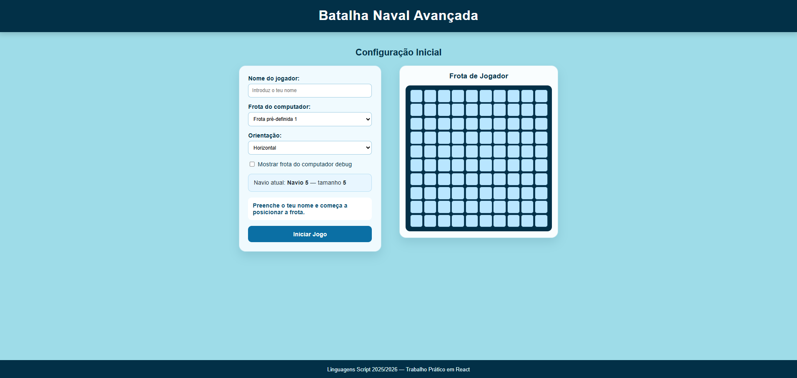
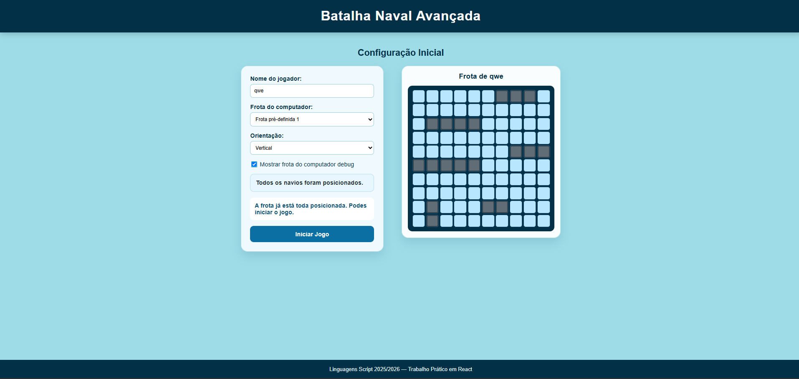
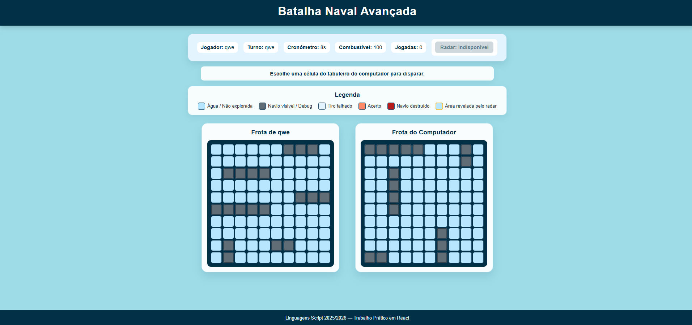
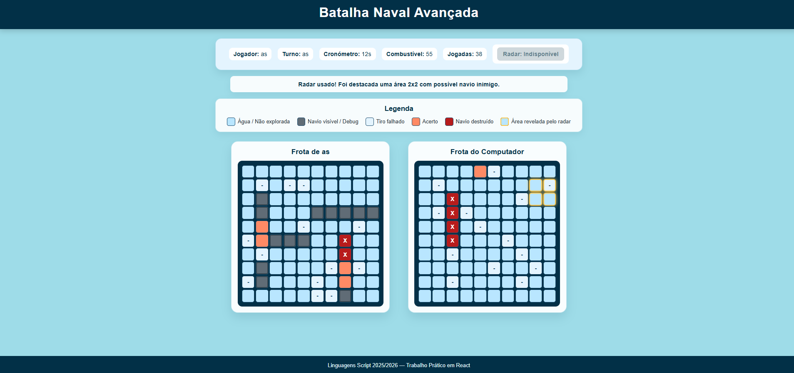

# Battleship Game

A web-based Battleship game developed with React and JavaScript as an academic project for the Script Languages course of the Computer Engineering degree at ISEC.

## Features

- Manual ship placement and validation
- Player vs computer gameplay
- Turn management
- Fuel system
- Game timer
- Intelligent radar system
- Computer targeting algorithm based on a target queue
- Responsive interface

## Technologies

- JavaScript ES6+
- React
- HTML5
- CSS3
- Vite

## Architecture

The application was developed using functional React components and makes use of:

- React Hooks
- Props
- Callbacks
- Modular components
- Helper functions
- CSS Grid
- Flexbox
- Responsive media queries

## Screenshots

### Game Start

### Ship Placement

### Gameplay

### Intelligent Radar

## Run locally

Clone the repository:

git clone https://github.com/Jose2018010598/Battleship-Game-React.git

Install dependencies:

npm install

Start the development server:

npm run dev